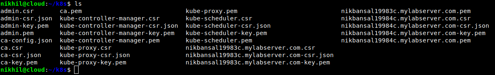

# JustTrying

This repository represents the manual installation of Kubernetes i.e without using kubeadm. I have also done the installation using kubeadm. 

If you want to do installation using kubeadm, refer to <a href="https://github.com/Nikhil2408/Building-a-Kubernetes-Cluster"> Building a Kubernetes Cluster </a> repository.


<h2> Attribution </h2>

Hello everyone, you are welcome to make use of this guide and learn from it but please do not copy without giving attribution to the author.

<h3> Kubernetes </h3>

Kubernetes (K8s) is an open-source system for automating deployment, scaling, and management of containerized applications. It automates the application infrastructure and make it easy to manage it. Kubernetes is all about managing containers. 

<h2> Architecture Implemented </h2>

<p align="center">
  
</p>

<h2> Requirements </h2>

From the architecture it is clear that 5 ubuntu servers are required. 2 Controller nodes, 2 Worker nodes and 1 Kubernetes API Load balancer server. I have used <a href="https://linuxacademy.com/"> LinuxAcademy </a> cloud servers and Ubuntu 18 as my operating system on each of the server.

Besides these five ubuntu servers, you will be requiring one more machine i.e. the local workstation from which you will be interacting with the Kubernetes Cluster.

<h2> Let's Start Building the Cluster manually </h2>

<h3> 1. Installing the Client tools on the local machine </h3>

In order to proceed further, first of all install two client tools on the local workstation. These two client tools are:-

* <b> cfssl </b>- It is a tool we are going to use to manage different certificates we will need to create in order to setup a kubernetes cluster.
* <b> kubectl </b> - It is a tool which is used to interact with the kubernetes from our local machine.

 <b> For cfssl: </b>
 
 <h4> a) Retrieving two binary files from web servers </h4>
 
 ```javascript
 wget -q --show-progress --https-only --timestamping \
 https://pkg.cfssl.org/R1.2/cfssl_linux-amd64 \
 https://pkg.cfssl.org/R1.2/cfssljson_linux-amd64
 ```
  
 
 <h4> b) Changing permissions for the files to make them executable </h4>
 
```javascript
chmod +x cfssl_linux-amd64 cfssljson_linux-amd64
```


<h4> c) Moving first file to appropriate location </h4>

```javascript
sudo mv cfssl_linux-amd64 /usr/local/bin/cfssl
```


<h4> d) Moving second file to appropriate location </h4>

```javascript
sudo mv cfssljson_linux-amd64 /usr/local/bin/cfssljson
```


<h4> e) Verifying cfssl client installation </h4>

```javascript
cfssl version
```


<b> For kubectl: </b>

<h4> a) Retrieving kubectl binary file from web server </h4>

```javascript
wget https://storage.googleapis.com/kubernetes-release/release/v1.10.2/bin/linux/amd64/kubectl
```


<h4> b) Changing permission for the kubectl file to make it executable </h4>

```javascript
chmod +x kubectl
```

<h4> c) Moving file to appropriate location </h4>

```javascript
sudo mv kubectl /usr/local/bin/
```


<h4> d) Verifying kubectl client </h4>

It's very important to add <b> --client </b> flag when verifying because by default kubectl interacts with the k8s cluster which I have not setup yet. <b> --client </b> gives us the information about local kubectl setup and not remote k8s cluster.

```javascript
kubectl version --client
```


<h3> 2. Creating a Certificate Authority and TLS Certificates for  Kubernetes</h3>

<b> Certificate </b> - Certificates are used to confirm identity. They are used to prove that you are who you say you are. In order to generate the certificates, certificate authority must be there. There are three types of certificates:- client certificates, K8s server API certificate and service account key pair certificate.

<b> Certificate Authority </b> -  A certificate authority provides the ability to confirm that a certificate is valid. A certificate authority can be used to validate any certificate that was issued using that CA.

<h4> a) Creating the Certificate Authority </h4>

Make sure you are in home directory. Create a directory using <b> mkdir </b> command.

```javascript
cd ~/
mkdir kthw
cd kthw/
```


Install cfssljson and cfssl by executing the following commands:

```javascript
sudo curl -s -L -o /bin/cfssl https://pkg.cfssl.org/R1.2/cfssl_linux-amd64
```

```javascript
sudo curl -s -L -o /bin/cfssljson https://pkg.cfssl.org/R1.2/cfssljson_linux-amd64
```

```javascript
sudo curl -s -L -o /bin/cfssl-certinfo https://pkg.cfssl.org/R1.2/cfssl-certinfo_linux-amd64
```

```javascript
sudo chmod +x /bin/cfssl*
```


Now, use the below command to generate the certificate authority. The whole command will be executed because of the presence of opening and curly braces.

```javascript
{

cat > ca-config.json << EOF
{
  "signing": {
    "default": {
      "expiry": "8760h"
    },
    "profiles": {
      "kubernetes": {
        "usages": ["signing", "key encipherment", "server auth", "client auth"],
        "expiry": "8760h"
      }
    }
  }
}
EOF

cat > ca-csr.json << EOF
{
  "CN": "Kubernetes",
  "key": {
    "algo": "rsa",
    "size": 2048
  },
  "names": [
    {
      "C": "US",
      "L": "Portland",
      "O": "Kubernetes",
      "OU": "CA",
      "ST": "Oregon"
    }
  ]
}
EOF

cfssl gencert -initca ca-csr.json | cfssljson -bare ca

}
```


* <b> ca-config.json </b> - It is a json config file for my certificate authority. It defines when will the CA expires and what can it be used for.

* <b> ca-csr.json </b> - csr stands for certificate signing request. This json file provides the configuration of the request to sign a new certificate.


Output for the above command will be displayed like this:


To see the files created after executing the command, run <b> ls </b>. You will notice two files are created along with above two json files. One is ca-key.pem which is the private certificate for certificate authority and other one is ca.pem which is the public certificate for certificate authority.

```javascript
ls
```


<h4> b) Generating the client certificates </h4>

Now, we have provisioned the certificate authority for the k8s cluster, we are ready to begin generating certificates. The first set of certificates are client certificates used by various componenets of K8s cluster. We will generate the following client certificates: <b> admin </b>, <b> kubelet </b>(one for each worker node), <b> kube-controller-manager </b>, <b> kube-proxy </b>and <b> kube-scheduler </b>.

Make sure you are inside the directory you created before.

<h5> Admin Client Certificate </h5>

```javascript
{

cat > admin-csr.json << EOF
{
  "CN": "admin",
  "key": {
    "algo": "rsa",
    "size": 2048
  },
  "names": [
    {
      "C": "US",
      "L": "Portland",
      "O": "system:masters",
      "OU": "Kubernetes The Hard Way",
      "ST": "Oregon"
    }
  ]
}
EOF

cfssl gencert \
  -ca=ca.pem \
  -ca-key=ca-key.pem \
  -config=ca-config.json \
  -profile=kubernetes \
  admin-csr.json | cfssljson -bare admin

}
```


Output of the above command will be:


<b> admin-key.pem </b> and <b> admin.pem </b> files will be generated after executing the command. One more file be generated which is <b> admin.csr </b>. You can check the files using <b> ls </b> command.

<h5> Kubelet Client Certificates </h5>

For generating Kubelet Client certificates (one for each worker node), make sure to set the variable for each worker node. Enter the actual cloud server values to the variables.

```javascript
WORKER0_HOST=<Public hostname of your first worker node cloud server>
WORKER0_IP=<Private IP of your first worker node cloud server>
WORKER1_HOST=<Public hostname of your second worker node cloud server>
WORKER1_IP=<Private IP of your second worker node cloud server>
```


Once your variable are set up with the correct credentials of our cloud server, execute the below command.

```javascript
{
cat > ${WORKER0_HOST}-csr.json << EOF
{
  "CN": "system:node:${WORKER0_HOST}",
  "key": {
    "algo": "rsa",
    "size": 2048
  },
  "names": [
    {
      "C": "US",
      "L": "Portland",
      "O": "system:nodes",
      "OU": "Kubernetes The Hard Way",
      "ST": "Oregon"
    }
  ]
}
EOF

cfssl gencert \
  -ca=ca.pem \
  -ca-key=ca-key.pem \
  -config=ca-config.json \
  -hostname=${WORKER0_IP},${WORKER0_HOST} \
  -profile=kubernetes \
  ${WORKER0_HOST}-csr.json | cfssljson -bare ${WORKER0_HOST}

cat > ${WORKER1_HOST}-csr.json << EOF
{
  "CN": "system:node:${WORKER1_HOST}",
  "key": {
    "algo": "rsa",
    "size": 2048
  },
  "names": [
    {
      "C": "US",
      "L": "Portland",
      "O": "system:nodes",
      "OU": "Kubernetes The Hard Way",
      "ST": "Oregon"
    }
  ]
}
EOF

cfssl gencert \
  -ca=ca.pem \
  -ca-key=ca-key.pem \
  -config=ca-config.json \
  -hostname=${WORKER1_IP},${WORKER1_HOST} \
  -profile=kubernetes \
  ${WORKER1_HOST}-csr.json | cfssljson -bare ${WORKER1_HOST}

}
```


You can check the files generated using <b> ls </b> command. The files will be generated for each worker node separately.


<h5> Controller Manager Client certificate </h5>
 
```javascript
{

cat > kube-controller-manager-csr.json << EOF
{
  "CN": "system:kube-controller-manager",
  "key": {
    "algo": "rsa",
    "size": 2048
  },
  "names": [
    {
      "C": "US",
      "L": "Portland",
      "O": "system:kube-controller-manager",
      "OU": "Kubernetes The Hard Way",
      "ST": "Oregon"
    }
  ]
}
EOF

cfssl gencert \
  -ca=ca.pem \
  -ca-key=ca-key.pem \
  -config=ca-config.json \
  -profile=kubernetes \
  kube-controller-manager-csr.json | cfssljson -bare kube-controller-manager

}
```


<b> kube-controller-manager-key.pem </b> and <b> kube-controller-manager.pem </b> files will be generated. Verify them using <b> ls </b> command.


<h5> Kube Proxy Client certificate </h5>

```javascript
{

cat > kube-proxy-csr.json << EOF
{
  "CN": "system:kube-proxy",
  "key": {
    "algo": "rsa",
    "size": 2048
  },
  "names": [
    {
      "C": "US",
      "L": "Portland",
      "O": "system:node-proxier",
      "OU": "Kubernetes The Hard Way",
      "ST": "Oregon"
    }
  ]
}
EOF

cfssl gencert \
  -ca=ca.pem \
  -ca-key=ca-key.pem \
  -config=ca-config.json \
  -profile=kubernetes \
  kube-proxy-csr.json | cfssljson -bare kube-proxy

}
```


<b> kube-proxy-key.pem </b> and <b> kube-proxy.pem </b> files will be generated. Verify them using <b> ls </b> command.


<h5> Kube Scheduler Client Certificate </h5>

```javascript
{

cat > kube-scheduler-csr.json << EOF
{
  "CN": "system:kube-scheduler",
  "key": {
    "algo": "rsa",
    "size": 2048
  },
  "names": [
    {
      "C": "US",
      "L": "Portland",
      "O": "system:kube-scheduler",
      "OU": "Kubernetes The Hard Way",
      "ST": "Oregon"
    }
  ]
}
EOF

cfssl gencert \
  -ca=ca.pem \
  -ca-key=ca-key.pem \
  -config=ca-config.json \
  -profile=kubernetes \
  kube-scheduler-csr.json | cfssljson -bare kube-scheduler

}
```


<b> kube-scheduler-key.pem </b> and <b> kube-scheduler.pem </b> files will be generated. Verify them using <b> ls </b> command.


