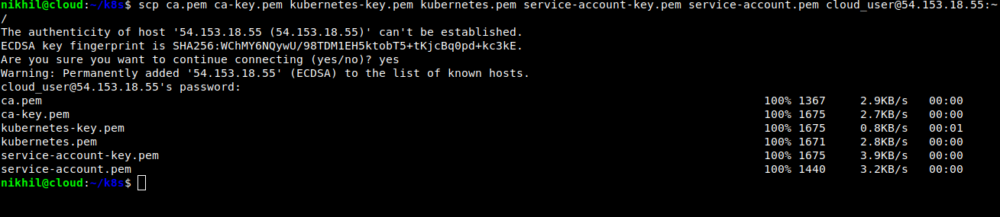
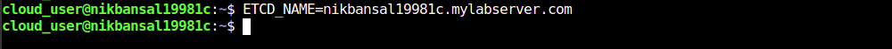
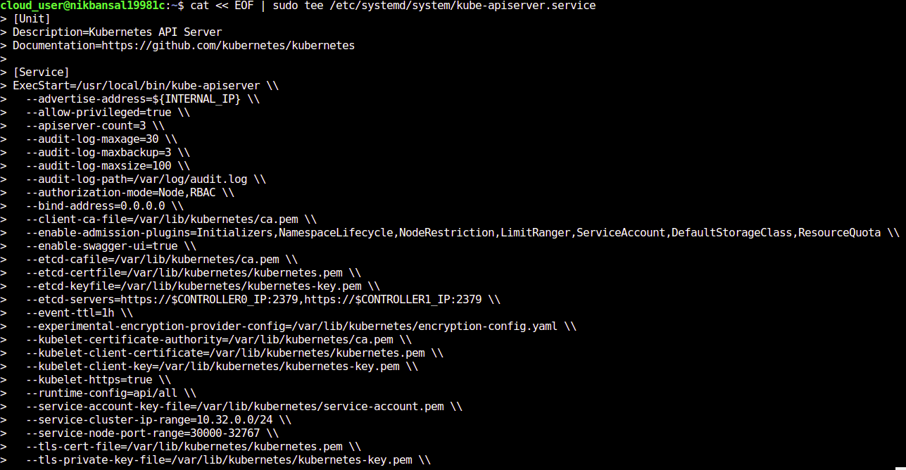
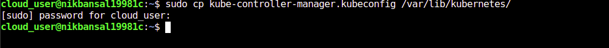
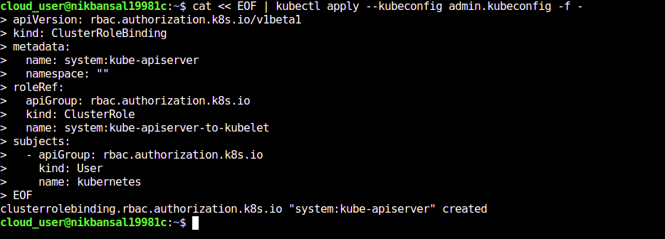
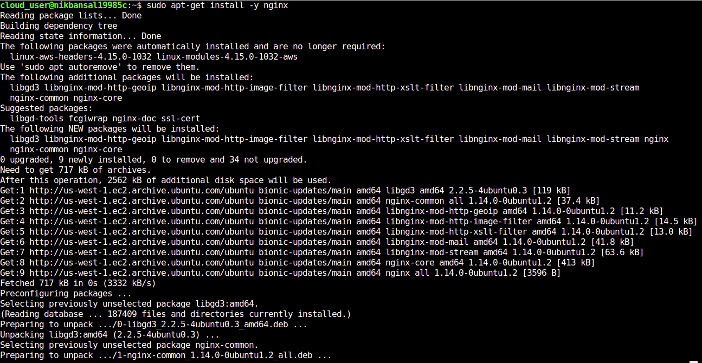

# Building a Kubernetes Cluster Manually

This repository represents the manual installation of Kubernetes i.e without using kubeadm. I have also done the installation using kubeadm. 

If you want to do installation using kubeadm, refer to <a href="https://github.com/Nikhil2408/Building-a-Kubernetes-Cluster"> Building a Kubernetes Cluster </a> repository.


<h2> Attribution </h2>

Hello everyone, you are welcome to make use of this guide and learn from it but please do not copy without giving attribution to the author.

<h3> Kubernetes </h3>

Kubernetes (K8s) is an open-source system for automating deployment, scaling, and management of containerized applications. It automates the application infrastructure and make it easy to manage it. Kubernetes is all about managing containers. 

<h2> Architecture Implemented </h2>

<p align="center">
  
</p>

<h2> Requirements </h2>

From the architecture it is clear that 5 ubuntu servers are required. 2 Controller nodes, 2 Worker nodes and 1 Kubernetes API Load balancer server. I have used <a href="https://linuxacademy.com/"> LinuxAcademy </a> cloud servers and Ubuntu 18 as my operating system on each of the server.

Besides these five ubuntu servers, you will be requiring one more machine i.e. the local workstation from which you will be interacting with the Kubernetes Cluster.

<h2> Let's Start Building the Cluster manually </h2>

<h3> 1. Installing the Client tools on the local machine </h3>

In order to proceed further, first of all install two client tools on the local workstation. These two client tools are:-

* <b> cfssl </b>- It is a tool we are going to use to manage different certificates we will need to create in order to setup a kubernetes cluster.
* <b> kubectl </b> - It is a tool which is used to interact with the kubernetes from our local machine.

 <b> For cfssl: </b>
 
 <h4> a) Retrieving two binary files from web servers </h4>
 
 ```javascript
 wget -q --show-progress --https-only --timestamping \
 https://pkg.cfssl.org/R1.2/cfssl_linux-amd64 \
 https://pkg.cfssl.org/R1.2/cfssljson_linux-amd64
 ```
  
 
 <h4> b) Changing permissions for the files to make them executable </h4>
 
```javascript
chmod +x cfssl_linux-amd64 cfssljson_linux-amd64
```


<h4> c) Moving first file to appropriate location </h4>

```javascript
sudo mv cfssl_linux-amd64 /usr/local/bin/cfssl
```


<h4> d) Moving second file to appropriate location </h4>

```javascript
sudo mv cfssljson_linux-amd64 /usr/local/bin/cfssljson
```


<h4> e) Verifying cfssl client installation </h4>

```javascript
cfssl version
```


<b> For kubectl: </b>

<h4> a) Retrieving kubectl binary file from web server </h4>

```javascript
wget https://storage.googleapis.com/kubernetes-release/release/v1.10.2/bin/linux/amd64/kubectl
```


<h4> b) Changing permission for the kubectl file to make it executable </h4>

```javascript
chmod +x kubectl
```

<h4> c) Moving file to appropriate location </h4>

```javascript
sudo mv kubectl /usr/local/bin/
```


<h4> d) Verifying kubectl client </h4>

It's very important to add <b> --client </b> flag when verifying because by default kubectl interacts with the k8s cluster which I have not setup yet. <b> --client </b> gives us the information about local kubectl setup and not remote k8s cluster.

```javascript
kubectl version --client
```


<h3> 2. Creating a Certificate Authority and TLS Certificates for  Kubernetes</h3>

<b> Certificate </b> - Certificates are used to confirm identity. They are used to prove that you are who you say you are. In order to generate the certificates, certificate authority must be there. There are three types of certificates:- client certificates, K8s server API certificate and service account key pair certificate.

<b> Certificate Authority </b> -  A certificate authority provides the ability to confirm that a certificate is valid. A certificate authority can be used to validate any certificate that was issued using that CA.

<h4> a) Creating the Certificate Authority </h4>

Make sure you are in home directory. Create a directory using <b> mkdir </b> command.

```javascript
cd ~/
mkdir kthw
cd kthw/
```


Install cfssljson and cfssl by executing the following commands:

```javascript
sudo curl -s -L -o /bin/cfssl https://pkg.cfssl.org/R1.2/cfssl_linux-amd64
```

```javascript
sudo curl -s -L -o /bin/cfssljson https://pkg.cfssl.org/R1.2/cfssljson_linux-amd64
```

```javascript
sudo curl -s -L -o /bin/cfssl-certinfo https://pkg.cfssl.org/R1.2/cfssl-certinfo_linux-amd64
```

```javascript
sudo chmod +x /bin/cfssl*
```


Now, use the below command to generate the certificate authority. The whole command will be executed because of the presence of opening and curly braces.

```javascript
{

cat > ca-config.json << EOF
{
  "signing": {
    "default": {
      "expiry": "8760h"
    },
    "profiles": {
      "kubernetes": {
        "usages": ["signing", "key encipherment", "server auth", "client auth"],
        "expiry": "8760h"
      }
    }
  }
}
EOF

cat > ca-csr.json << EOF
{
  "CN": "Kubernetes",
  "key": {
    "algo": "rsa",
    "size": 2048
  },
  "names": [
    {
      "C": "US",
      "L": "Portland",
      "O": "Kubernetes",
      "OU": "CA",
      "ST": "Oregon"
    }
  ]
}
EOF

cfssl gencert -initca ca-csr.json | cfssljson -bare ca

}
```


* <b> ca-config.json </b> - It is a json config file for my certificate authority. It defines when will the CA expires and what can it be used for.

* <b> ca-csr.json </b> - csr stands for certificate signing request. This json file provides the configuration of the request to sign a new certificate.


Output for the above command will be displayed like this:


To see the files created after executing the command, run <b> ls </b>. You will notice two files are created along with above two json files. One is ca-key.pem which is the private certificate for certificate authority and other one is ca.pem which is the public certificate for certificate authority.

```javascript
ls
```


<h4> b) Generating the client certificates </h4>

Now, we have provisioned the certificate authority for the k8s cluster, we are ready to begin generating certificates. The first set of certificates are client certificates used by various componenets of K8s cluster. We will generate the following client certificates: <b> admin </b>, <b> kubelet </b>(one for each worker node), <b> kube-controller-manager </b>, <b> kube-proxy </b>and <b> kube-scheduler </b>.

Make sure you are inside the directory you created before.

<h5> Admin Client Certificate </h5>

```javascript
{

cat > admin-csr.json << EOF
{
  "CN": "admin",
  "key": {
    "algo": "rsa",
    "size": 2048
  },
  "names": [
    {
      "C": "US",
      "L": "Portland",
      "O": "system:masters",
      "OU": "Kubernetes The Hard Way",
      "ST": "Oregon"
    }
  ]
}
EOF

cfssl gencert \
  -ca=ca.pem \
  -ca-key=ca-key.pem \
  -config=ca-config.json \
  -profile=kubernetes \
  admin-csr.json | cfssljson -bare admin

}
```


Output of the above command will be:


<b> admin-key.pem </b> and <b> admin.pem </b> files will be generated after executing the command. One more file be generated which is <b> admin.csr </b>. You can check the files using <b> ls </b> command.

<h5> Kubelet Client Certificates </h5>

For generating Kubelet Client certificates (one for each worker node), make sure to set the variable for each worker node. Enter the actual cloud server values to the variables.

```javascript
WORKER0_HOST=<Public hostname of your first worker node cloud server>
WORKER0_IP=<Private IP of your first worker node cloud server>
WORKER1_HOST=<Public hostname of your second worker node cloud server>
WORKER1_IP=<Private IP of your second worker node cloud server>
```


Once your variable are set up with the correct credentials of our cloud server, execute the below command.

```javascript
{
cat > ${WORKER0_HOST}-csr.json << EOF
{
  "CN": "system:node:${WORKER0_HOST}",
  "key": {
    "algo": "rsa",
    "size": 2048
  },
  "names": [
    {
      "C": "US",
      "L": "Portland",
      "O": "system:nodes",
      "OU": "Kubernetes The Hard Way",
      "ST": "Oregon"
    }
  ]
}
EOF

cfssl gencert \
  -ca=ca.pem \
  -ca-key=ca-key.pem \
  -config=ca-config.json \
  -hostname=${WORKER0_IP},${WORKER0_HOST} \
  -profile=kubernetes \
  ${WORKER0_HOST}-csr.json | cfssljson -bare ${WORKER0_HOST}

cat > ${WORKER1_HOST}-csr.json << EOF
{
  "CN": "system:node:${WORKER1_HOST}",
  "key": {
    "algo": "rsa",
    "size": 2048
  },
  "names": [
    {
      "C": "US",
      "L": "Portland",
      "O": "system:nodes",
      "OU": "Kubernetes The Hard Way",
      "ST": "Oregon"
    }
  ]
}
EOF

cfssl gencert \
  -ca=ca.pem \
  -ca-key=ca-key.pem \
  -config=ca-config.json \
  -hostname=${WORKER1_IP},${WORKER1_HOST} \
  -profile=kubernetes \
  ${WORKER1_HOST}-csr.json | cfssljson -bare ${WORKER1_HOST}

}
```


You can check the files generated using <b> ls </b> command. The files will be generated for each worker node separately.


<h5> Controller Manager Client certificate </h5>
 
```javascript
{

cat > kube-controller-manager-csr.json << EOF
{
  "CN": "system:kube-controller-manager",
  "key": {
    "algo": "rsa",
    "size": 2048
  },
  "names": [
    {
      "C": "US",
      "L": "Portland",
      "O": "system:kube-controller-manager",
      "OU": "Kubernetes The Hard Way",
      "ST": "Oregon"
    }
  ]
}
EOF

cfssl gencert \
  -ca=ca.pem \
  -ca-key=ca-key.pem \
  -config=ca-config.json \
  -profile=kubernetes \
  kube-controller-manager-csr.json | cfssljson -bare kube-controller-manager

}
```


<b> kube-controller-manager-key.pem </b> and <b> kube-controller-manager.pem </b> files will be generated. Verify them using <b> ls </b> command.


<h5> Kube Proxy Client certificate </h5>

```javascript
{

cat > kube-proxy-csr.json << EOF
{
  "CN": "system:kube-proxy",
  "key": {
    "algo": "rsa",
    "size": 2048
  },
  "names": [
    {
      "C": "US",
      "L": "Portland",
      "O": "system:node-proxier",
      "OU": "Kubernetes The Hard Way",
      "ST": "Oregon"
    }
  ]
}
EOF

cfssl gencert \
  -ca=ca.pem \
  -ca-key=ca-key.pem \
  -config=ca-config.json \
  -profile=kubernetes \
  kube-proxy-csr.json | cfssljson -bare kube-proxy

}
```


<b> kube-proxy-key.pem </b> and <b> kube-proxy.pem </b> files will be generated. Verify them using <b> ls </b> command.


<h5> Kube Scheduler Client Certificate </h5>

```javascript
{

cat > kube-scheduler-csr.json << EOF
{
  "CN": "system:kube-scheduler",
  "key": {
    "algo": "rsa",
    "size": 2048
  },
  "names": [
    {
      "C": "US",
      "L": "Portland",
      "O": "system:kube-scheduler",
      "OU": "Kubernetes The Hard Way",
      "ST": "Oregon"
    }
  ]
}
EOF

cfssl gencert \
  -ca=ca.pem \
  -ca-key=ca-key.pem \
  -config=ca-config.json \
  -profile=kubernetes \
  kube-scheduler-csr.json | cfssljson -bare kube-scheduler

}
```


<b> kube-scheduler-key.pem </b> and <b> kube-scheduler.pem </b> files will be generated. Verify them using <b> ls </b> command.


<h4> c)  Generating the Kubernetes API Server Certificate </h4>

We have generated all of the the client certificates our Kubernetes cluster will need, but we also need a server certificate for the Kubernetes API.

Place the correct credentials from your cloud server to this CERT_HOSTNAME variable.

```javascript
CERT_HOSTNAME=10.32.0.1,<controller node 1 Private IP>,<controller node 1 hostname>,<controller node 2 Private IP>,<controller node 2 hostname>,<API load balancer Private IP>,<API load balancer hostname>,127.0.0.1,localhost,kubernetes.default
```


This CERT_HOSTNAME variable in the json file will be replaced with credentials provided above.

```javascript
{

cat > kubernetes-csr.json << EOF
{
  "CN": "kubernetes",
  "key": {
    "algo": "rsa",
    "size": 2048
  },
  "names": [
    {
      "C": "US",
      "L": "Portland",
      "O": "Kubernetes",
      "OU": "Kubernetes The Hard Way",
      "ST": "Oregon"
    }
  ]
}
EOF

cfssl gencert \
  -ca=ca.pem \
  -ca-key=ca-key.pem \
  -config=ca-config.json \
  -hostname=${CERT_HOSTNAME} \
  -profile=kubernetes \
  kubernetes-csr.json | cfssljson -bare kubernetes

}
```


<b> kubernetes-key.pem </b> and <b> kubernetes.pem </b> files will be created. Verify them using <b> ls </b> command.


<h4> d) Generating the Service Account Key Pair </h4>

Kubernetes provides the ability for service accounts to authenticate using tokens. It uses a key-pair to provide signatures for those tokens.

```javascript
{

cat > service-account-csr.json << EOF
{
  "CN": "service-accounts",
  "key": {
    "algo": "rsa",
    "size": 2048
  },
  "names": [
    {
      "C": "US",
      "L": "Portland",
      "O": "Kubernetes",
      "OU": "Kubernetes The Hard Way",
      "ST": "Oregon"
    }
  ]
}
EOF

cfssl gencert \
  -ca=ca.pem \
  -ca-key=ca-key.pem \
  -config=ca-config.json \
  -profile=kubernetes \
  service-account-csr.json | cfssljson -bare service-account

}
```


<b> service-account-key.pem </b> and <b> service-account.pem </b> files will be created. Verify them using <b> ls </b> command.


<h4> d) Distributing the Certificate Files </h4>

Now that all of the necessary certificates have been generated, we need to move the files onto the appropriate servers.
<b> scp </b> stands for secure copy command is used to copy files/folders between servers in secure way.

<h5> Move certificates to the worker nodes </h5>

```javascript
scp ca.pem <worker 1 hostname>-key.pem <worker 1 hostname>.pem user@<worker 1 public IP>:~/
```


```javascript
scp ca.pem <worker 2 hostname>-key.pem <worker 2 hostname>.pem user@<worker 2 public IP>:~/
```


<h5> Move certificates to the controller nodes </h5>

```javascript
scp ca.pem ca-key.pem kubernetes-key.pem kubernetes.pem \
    service-account-key.pem service-account.pem user@<controller 1 public IP>:~/
```


```javascript
scp ca.pem ca-key.pem kubernetes-key.pem kubernetes.pem \
    service-account-key.pem service-account.pem user@<controller 2 public IP>:~/
```


<h3> 3. Generating Kubeconfigs for the cluster and distributing files to the cloud servers </h3>

A Kubernetes configuration file, or kubeconfig is a file that stores information about clusters, users, namespaces and authentication mechanisms. It contains the configuration data needed to connect to and interact with one or more kubernetes clusters.

It contains the information such as:
* The location of the cluster you want to connect to.
* What user you want to authenticate as.
* Data needed in order to authenticate such as tokens or client certificates.

We can even define multiple contexts in a kubeconfig file allowing you to easily switch between multiple clusters but here I will be using single context.

kubeconfigs can be generated using kubectl on the local machine which you have used to generate certificates.
* <b> kubectl config set-cluster </b> is used to set up the configuration for the location of the cluster.
* <b> kubectl config set-credentials </b> is used to set the username and client certificates that will be used to authenticate.
* <b> kubectl config set-context </b> default is used to set the default context.
* <b> kubectl config use-context default </b> is used to set the current context to the configuration we have provided.

<h4> a) Setting up the environment variable </h4>

Create an environment variable that will store the address of the kubernetes API server and set it to the private IP address of the Kubernetes load balancer server.
This variable is used to determine where our kubelet service is going to locate the k8s API.

```javascript
KUBERNETES_ADDRESS=<load balancer private ip>
```


<h4> b) Generating the kubeconfig files </h4>

<h5> Creating the kubelet kubeconfig for each worker node </h5>

Remeber to replace all the placeholders with your cloud servers credentials.

```javascript
for instance in <worker 1 hostname> <worker 2 hostname>; do
  kubectl config set-cluster kubernetes-the-hard-way \
    --certificate-authority=ca.pem \
    --embed-certs=true \
    --server=https://${KUBERNETES_ADDRESS}:6443 \
    --kubeconfig=${instance}.kubeconfig

  kubectl config set-credentials system:node:${instance} \
    --client-certificate=${instance}.pem \
    --client-key=${instance}-key.pem \
    --embed-certs=true \
    --kubeconfig=${instance}.kubeconfig

  kubectl config set-context default \
    --cluster=kubernetes-the-hard-way \
    --user=system:node:${instance} \
    --kubeconfig=${instance}.kubeconfig

  kubectl config use-context default --kubeconfig=${instance}.kubeconfig
done
```


After generating the kubelet kube-config use cat command to see the configuration file of a particular worker node


<h5> Creating the kube-proxy kubeconfig </h5>

```javascript
{
  kubectl config set-cluster kubernetes-the-hard-way \
    --certificate-authority=ca.pem \
    --embed-certs=true \
    --server=https://${KUBERNETES_ADDRESS}:6443 \
    --kubeconfig=kube-proxy.kubeconfig

  kubectl config set-credentials system:kube-proxy \
    --client-certificate=kube-proxy.pem \
    --client-key=kube-proxy-key.pem \
    --embed-certs=true \
    --kubeconfig=kube-proxy.kubeconfig

  kubectl config set-context default \
    --cluster=kubernetes-the-hard-way \
    --user=system:kube-proxy \
    --kubeconfig=kube-proxy.kubeconfig

  kubectl config use-context default --kubeconfig=kube-proxy.kubeconfig
}
```


<h5> Creating the kube-controller-manager kubeconfig </h5>

Here I am using localhost because kube-controller-manager component is present in the same cloud server where API server is there. You can refer the architecture which I have shown at the starting of this guide.

```javascript
{
  kubectl config set-cluster kubernetes-the-hard-way \
    --certificate-authority=ca.pem \
    --embed-certs=true \
    --server=https://127.0.0.1:6443 \
    --kubeconfig=kube-controller-manager.kubeconfig

  kubectl config set-credentials system:kube-controller-manager \
    --client-certificate=kube-controller-manager.pem \
    --client-key=kube-controller-manager-key.pem \
    --embed-certs=true \
    --kubeconfig=kube-controller-manager.kubeconfig

  kubectl config set-context default \
    --cluster=kubernetes-the-hard-way \
    --user=system:kube-controller-manager \
    --kubeconfig=kube-controller-manager.kubeconfig

  kubectl config use-context default --kubeconfig=kube-controller-manager.kubeconfig
}
```


You can verify creation of kube-controller-manager config file using <b> ls </b> command.


<h5> Creating the kube-scheduler kubeconfig </h5>

```javascript
{
  kubectl config set-cluster kubernetes-the-hard-way \
    --certificate-authority=ca.pem \
    --embed-certs=true \
    --server=https://127.0.0.1:6443 \
    --kubeconfig=kube-scheduler.kubeconfig

  kubectl config set-credentials system:kube-scheduler \
    --client-certificate=kube-scheduler.pem \
    --client-key=kube-scheduler-key.pem \
    --embed-certs=true \
    --kubeconfig=kube-scheduler.kubeconfig

  kubectl config set-context default \
    --cluster=kubernetes-the-hard-way \
    --user=system:kube-scheduler \
    --kubeconfig=kube-scheduler.kubeconfig

  kubectl config use-context default --kubeconfig=kube-scheduler.kubeconfig
}
```


You can verify creation of kube-scheduler config file using <b> ls </b> command.


<h5> Creating the admin kubeconfig </h5>

```javascript
{
  kubectl config set-cluster kubernetes-the-hard-way \
    --certificate-authority=ca.pem \
    --embed-certs=true \
    --server=https://127.0.0.1:6443 \
    --kubeconfig=admin.kubeconfig

  kubectl config set-credentials admin \
    --client-certificate=admin.pem \
    --client-key=admin-key.pem \
    --embed-certs=true \
    --kubeconfig=admin.kubeconfig

  kubectl config set-context default \
    --cluster=kubernetes-the-hard-way \
    --user=admin \
    --kubeconfig=admin.kubeconfig

  kubectl config use-context default --kubeconfig=admin.kubeconfig
}
```


You can verify creation of admin config file using <b> ls </b> command.


<h4> c) Distributing the kubeconfig files </h4>

Now that we have generated the kubeconfig files that we will need in order to configure our Kubernetes cluster, we need to make sure that each cloud server has a copy of the kubeconfig files. We will distribute the kubeconfig files to each of the worker and controller nodes.

Make sure to replace all the placeholders with the actual values from your cloud servers.

<h5> Move certificates to the worker nodes </h5>

```javascript
scp <worker 1 hostname>.kubeconfig kube-proxy.kubeconfig user@<worker 1 public IP>:~/
```


```javascript
scp <worker 2 hostname>.kubeconfig kube-proxy.kubeconfig user@<worker 2 public IP>:~/
```


<h5> Move certificates to the controller nodes </h5>

```javascript
scp admin.kubeconfig kube-controller-manager.kubeconfig kube-scheduler.kubeconfig user@<controller 1 public IP>:~/
```


```javascript
scp admin.kubeconfig kube-controller-manager.kubeconfig kube-scheduler.kubeconfig user@<controller 2 public IP>:~/
```


<h3> 4. Generating Data Encryption Config and distributing them to controller servers </h3>

Our important security practice is to ensure that sensitive data is never stored in plain text. Kubernetes offers the ability to encrypt sensitive data when it is stored.

In order to use this feature it is necessary to provide K8s with a data encryption config containing an encryption config.

<h4> a) Create an environment variable which stores the encrytion key </h4>

It will randomnly generate the characters and I have taken first 32 characters in encryption key.

```javascript
ENCRYPTION_KEY=$(head -c 32 /dev/urandom | base64)
```


Verify your encryption key


<h4> b) Creating the encryption-config yaml file </h4>

```javascript
cat > encryption-config.yaml << EOF
kind: EncryptionConfig
apiVersion: v1
resources:
  - resources:
      - secrets
    providers:
      - aescbc:
          keys:
            - name: key1
              secret: ${ENCRYPTION_KEY}
      - identity: {}
EOF
```


Verify the encryption-config file using ls command.


<h4> c) Distributing the Data Encryption config file to controller nodes</h4>

<h5> First controller node </h5>

```javascript
scp encryption-config.yaml user@<controller 1 public ip>:~/
```


<h5> Second controller node </h5>

```javascript
scp encryption-config.yaml user@<controller 2 public ip>:~/
```


<h3> 5. Bootstrapping the etcd Cluster </h3>

etcd is a distributed key value store that provides a reliable way to store data across a cluster of machines. etcd provides a way to store data across a distributed cluster of machines and make sure the data is synchronized across all machines.

Kubernetes used etcd to store all of its internal data about cluster state. We will install etcd on each of our controller node and create an etcd cluster that include all of those controller nodes.

The commands in this step must be run on each controller node. Wherever there will be a difference in the commands between controller nodes, I will show you.

<h4> a) Downloading etcd binary files </h4>

```javascript
wget -q --show-progress --https-only --timestamping \
  "https://github.com/coreos/etcd/releases/download/v3.3.5/etcd-v3.3.5-linux-amd64.tar.gz"
```


<h4> b) Extracting the downloaded archive file </h4>

```javascript
tar -xvf etcd-v3.3.5-linux-amd64.tar.gz
```


<h4> c) Moving the contents of archive file to appropriate location </h4>

```javascript
sudo mv etcd-v3.3.5-linux-amd64/etcd* /usr/local/bin/
```


<h4> d) Create some directories </h4>

```javascript
sudo mkdir -p /etc/etcd /var/lib/etcd
```


<h4> e) Copying some certificates files to etcd directory </h4>

Use ls command to list out all certificate files present in that controller node.

```javascript
sudo cp ca.pem kubernetes-key.pem kubernetes.pem /etc/etcd/
```


<h4> f) Setting up some environment variables </h4>

<b> On controller node 1: </b>

```javascript
ETCD_NAME=<cloud server hostname>
```


```javascript
INTERNAL_IP=$(curl http://169.254.169.254/latest/meta-data/local-ipv4)
```


```javascript
INITIAL_CLUSTER=<controller 1 hostname>=https://<controller 1 private ip>:2380,<controller 2 hostname>=https://<controller 2 private ip>:2380
```


<b> On controller node 2: </b>


```javascript
ETCD_NAME=<cloud server hostname>
```


```javascript
INTERNAL_IP=$(curl http://169.254.169.254/latest/meta-data/local-ipv4)
```


```javascript
INITIAL_CLUSTER=<controller 1 hostname>=https://<controller 1 private ip>:2380,<controller 2 hostname>=https://<controller 2 private ip>:2380
```


<h4> g) Create a systemd unit file for etcd </h4>

This command uses the environment variables created in the previous step.

```javascript
cat << EOF | sudo tee /etc/systemd/system/etcd.service
[Unit]
Description=etcd
Documentation=https://github.com/coreos

[Service]
ExecStart=/usr/local/bin/etcd \\
  --name ${ETCD_NAME} \\
  --cert-file=/etc/etcd/kubernetes.pem \\
  --key-file=/etc/etcd/kubernetes-key.pem \\
  --peer-cert-file=/etc/etcd/kubernetes.pem \\
  --peer-key-file=/etc/etcd/kubernetes-key.pem \\
  --trusted-ca-file=/etc/etcd/ca.pem \\
  --peer-trusted-ca-file=/etc/etcd/ca.pem \\
  --peer-client-cert-auth \\
  --client-cert-auth \\
  --initial-advertise-peer-urls https://${INTERNAL_IP}:2380 \\
  --listen-peer-urls https://${INTERNAL_IP}:2380 \\
  --listen-client-urls https://${INTERNAL_IP}:2379,https://127.0.0.1:2379 \\
  --advertise-client-urls https://${INTERNAL_IP}:2379 \\
  --initial-cluster-token etcd-cluster-0 \\
  --initial-cluster ${INITIAL_CLUSTER} \\
  --initial-cluster-state new \\
  --data-dir=/var/lib/etcd
Restart=on-failure
RestartSec=5

[Install]
WantedBy=multi-user.target
EOF
```


<b> Output of 1st controller node: </b>


<b> Output of 2nd controller node: </b>


<h4> g) Start and enable the etcd service </h4>

```javascript
sudo systemctl daemon-reload
```


```javascript
sudo systemctl enable etcd
```


```javascript
sudo systemctl start etcd
```


Verify that the etcd service started up successfully or not.

```javascript
sudo systemctl status etcd
```


<h4> h) Verify that etcd is working correctly or not </h4>

The output should list your two etcd nodes:

```javascript
sudo ETCDCTL_API=3 etcdctl member list \
  --endpoints=https://127.0.0.1:2379 \
  --cacert=/etc/etcd/ca.pem \
  --cert=/etc/etcd/kubernetes.pem \
  --key=/etc/etcd/kubernetes-key.pem
```

<b> For 1st controller node: </b>


<b> For 2nd controller node: </b>


<h3> 6. Bootstrapping the Kubernetes Control Plane </h3>

The kubernetes Control plane is a set of services that control the K8s cluster. Like many orchestration products, k8s has control servers and worker servers.
Control plane components make global decisions about the cluster(i.e. scheduling) and detect and respond to cluster events(i.e. starting up a new pod when a replication controller's replicas field is unsatisfied).

<b> Components of K8s Control Plane: </b>
* kube-api server
* etcd 
* kube-controller-manager
* kube-scheduler

In this step we will install each component of control plane on each controller node. The below commands must be executed on both the controller nodes.

<h4> a) Create a configuration directory </h4>

```javascript
sudo mkdir -p /etc/kubernetes/config
```


<h4> b) Downloading binary files of components of control plane </h4>

We will also download kubectl binary file although that is not the component of control plane. It is necessary to have kubectl on controller node to interact with the K8s cluster when the cluster is ready.

```javascript
wget -q --show-progress --https-only --timestamping \
  "https://storage.googleapis.com/kubernetes-release/release/v1.10.2/bin/linux/amd64/kube-apiserver" \
  "https://storage.googleapis.com/kubernetes-release/release/v1.10.2/bin/linux/amd64/kube-controller-manager" \
  "https://storage.googleapis.com/kubernetes-release/release/v1.10.2/bin/linux/amd64/kube-scheduler" \
  "https://storage.googleapis.com/kubernetes-release/release/v1.10.2/bin/linux/amd64/kubectl"
```


<h4> c) Changing permissions for the files to make them executable </h4>

```javascript
chmod +x kube-apiserver kube-controller-manager kube-scheduler kubectl
```


<h4> d) Moving each component file to appropriate location </h4>

```javascript
sudo mv kube-apiserver kube-controller-manager kube-scheduler kubectl /usr/local/bin/
```


<b> Setting up the kube-api server </b>

The Kubernetes API server provides the primary interface for the Kubernetes control plane and the cluster as a whole. When you interact with Kubernetes, you are nearly always doing it through the Kubernetes API server. 

<h4> a) Create a directory </h4>

```javascript
sudo mkdir -p /var/lib/kubernetes/
```


<h4> b) Transferring client certificates to the directory </h4>

```javascript
sudo cp ca.pem ca-key.pem kubernetes-key.pem kubernetes.pem \
  service-account-key.pem service-account.pem \
  encryption-config.yaml /var/lib/kubernetes/
```


<h4> c) Setting up some environment variables </h4>

Set some environment variables that will be used to create the systemd unit file. Make sure you replace the placeholders with their actual values

```javascript
INTERNAL_IP=$(curl http://169.254.169.254/latest/meta-data/local-ipv4)
```


```javascript
CONTROLLER0_IP=<private ip of controller 0>
CONTROLLER1_IP=<private ip of controller 1>
```


<h4> d) Create a systemd unit file for kube-api server </h4>

```javascript
cat << EOF | sudo tee /etc/systemd/system/kube-apiserver.service
[Unit]
Description=Kubernetes API Server
Documentation=https://github.com/kubernetes/kubernetes

[Service]
ExecStart=/usr/local/bin/kube-apiserver \\
  --advertise-address=${INTERNAL_IP} \\
  --allow-privileged=true \\
  --apiserver-count=3 \\
  --audit-log-maxage=30 \\
  --audit-log-maxbackup=3 \\
  --audit-log-maxsize=100 \\
  --audit-log-path=/var/log/audit.log \\
  --authorization-mode=Node,RBAC \\
  --bind-address=0.0.0.0 \\
  --client-ca-file=/var/lib/kubernetes/ca.pem \\
  --enable-.dmission-plugins=Initializers,NamespaceLifecycle,NodeRestriction,LimitRanger,ServiceAccount,DefaultStorageClass,ResourceQuota \\
  --enable-swagger-ui=true \\
  --etcd-cafile=/var/lib/kubernetes/ca.pem \\
  --etcd-certfile=/var/lib/kubernetes/kubernetes.pem \\
  --etcd-keyfile=/var/lib/kubernetes/kubernetes-key.pem \\
  --etcd-servers=https://$CONTROLLER0_IP:2379,https://$CONTROLLER1_IP:2379 \\
  --event-ttl=1h \\
  --experimental-encryption-provider-config=/var/lib/kubernetes/encryption-config.yaml \\
  --kubelet-certificate-authority=/var/lib/kubernetes/ca.pem \\
  --kubelet-client-certificate=/var/lib/kubernetes/kubernetes.pem \\
  --kubelet-client-key=/var/lib/kubernetes/kubernetes-key.pem \\
  --kubelet-https=true \\
  --runtime-config=api/all \\
  --service-account-key-file=/var/lib/kubernetes/service-account.pem \\
  --service-cluster-ip-range=10.32.0.0/24 \\
  --service-node-port-range=30000-32767 \\
  --tls-cert-file=/var/lib/kubernetes/kubernetes.pem \\
  --tls-private-key-file=/var/lib/kubernetes/kubernetes-key.pem \\
  --v=2 \\
  --kubelet-preferred-address-types=InternalIP,InternalDNS,Hostname,ExternalIP,ExternalDNS
Restart=on-failure
RestartSec=5

[Install]
WantedBy=multi-user.target
EOF
```


<b> Setting up the kube-controller manager </b>

<h4> a) Copy kube-controller manager config file to the directory which we have made in the previous step </h4>

```javascript
sudo cp kube-controller-manager.kubeconfig /var/lib/kubernetes/
```


<h4> b) Create a systemd unit file for kube-controller manager </h4>

```javascript
cat << EOF | sudo tee /etc/systemd/system/kube-controller-manager.service
[Unit]
Description=Kubernetes Controller Manager
Documentation=https://github.com/kubernetes/kubernetes

[Service]
ExecStart=/usr/local/bin/kube-controller-manager \\
  --address=0.0.0.0 \\
  --cluster-cidr=10.200.0.0/16 \\
  --cluster-name=kubernetes \\
  --cluster-signing-cert-file=/var/lib/kubernetes/ca.pem \\
  --cluster-signing-key-file=/var/lib/kubernetes/ca-key.pem \\
  --kubeconfig=/var/lib/kubernetes/kube-controller-manager.kubeconfig \\
  --leader-elect=true \\
  --root-ca-file=/var/lib/kubernetes/ca.pem \\
  --service-account-private-key-file=/var/lib/kubernetes/service-account-key.pem \\
  --service-cluster-ip-range=10.32.0.0/24 \\
  --use-service-account-credentials=true \\
  --v=2
Restart=on-failure
RestartSec=5

[Install]
WantedBy=multi-user.target
EOF
```


<b> Setting up the kube-scheduler </b>

<h4> a) Copy kube-scheduler config file to the same directory </h4>

```javascript
sudo cp kube-scheduler.kubeconfig /var/lib/kubernetes/
```


<h4> b) Generate the kube-scheduler yaml config file </h4>

```javascript
cat << EOF | sudo tee /etc/kubernetes/config/kube-scheduler.yaml
apiVersion: componentconfig/v1alpha1
kind: KubeSchedulerConfiguration
clientConnection:
  kubeconfig: "/var/lib/kubernetes/kube-scheduler.kubeconfig"
leaderElection:
  leaderElect: true
EOF
```


<h4> c) Create a systemd unit file for kube-scheduler </h4>

```javacsript
cat << EOF | sudo tee /etc/systemd/system/kube-scheduler.service
[Unit]
Description=Kubernetes Scheduler
Documentation=https://github.com/kubernetes/kubernetes

[Service]
ExecStart=/usr/local/bin/kube-scheduler \\
  --config=/etc/kubernetes/config/kube-scheduler.yaml \\
  --v=2
Restart=on-failure
RestartSec=5

[Install]
WantedBy=multi-user.target
EOF
```


Now that we have setup all the control plane components we will enable and start all the components.

```javascript
sudo systemctl daemon-reload
```


```javascript
sudo systemctl enable kube-apiserver kube-controller-manager kube-scheduler
```


```javascript
sudo systemctl start kube-apiserver kube-controller-manager kube-scheduler
```


After starting all the components, it's good to verify all the components are working or not. Make sure all the services are active.

```javascript
sudo systemctl status kube-apiserver kube-controller-manager kube-scheduler
```


Use kubectl to check componentstatuses and I am passing admin.kubeconfig to authenticate myself to the K8s API Server.

```javascript
kubectl get componentstatuses --kubeconfig admin.kubeconfig
```


<b> Setting up RBAC (Role-Based Access Control) for Kubelet Authorization </b>

It is a mechanism we used in K8s to create roles and assign permission to different users. Its the way to do authorization. We need to make sure that the K8s API has permissions to access the kubelet API on each worker node and perform certain common tasks. We will create a ClusterRole with the necessary permissions and assign the role to the K8s user with a ClusterRoleBinding.

<b> Note: </b> These commands only need to be run on one control node.

<h4> a) Create a role with the necessary permissions </h4>

```javascript
cat << EOF | kubectl apply --kubeconfig admin.kubeconfig -f -
apiVersion: rbac.authorization.k8s.io/v1beta1
kind: ClusterRole
metadata:
  annotations:
    rbac.authorization.kubernetes.io/autoupdate: "true"
  labels:
    kubernetes.io/bootstrapping: rbac-defaults
  name: system:kube-apiserver-to-kubelet
rules:
  - apiGroups:
      - ""
    resources:
      - nodes/proxy
      - nodes/stats
      - nodes/log
      - nodes/spec
      - nodes/metrics
    verbs:
      - "*"
EOF
```


<h4> b) Bind the role to the kubernetes user </h4>

```javascript
cat << EOF | kubectl apply --kubeconfig admin.kubeconfig -f -
apiVersion: rbac.authorization.k8s.io/v1beta1
kind: ClusterRoleBinding
metadata:
  name: system:kube-apiserver
  namespace: ""
roleRef:
  apiGroup: rbac.authorization.k8s.io
  kind: ClusterRole
  name: system:kube-apiserver-to-kubelet
subjects:
  - apiGroup: rbac.authorization.k8s.io
    kind: User
    name: kubernetes
EOF
```


<b> Setting up a Kube API Frontend Load Balancer </b>

In order to achieve redundancy for your Kubernetes cluster, you will need to load balance usage of the Kubernetes API across multiple control nodes.

<b> Note: </b>Run these on the server that you have designated as your load balancer server.

<h4> a) Install Nginx </h4>

```javascript
sudo apt-get install -y nginx
```


<h4> b) Making sure Nginx starts automatically when our server starts </h4>

```javascript
sudo systemctl enable nginx
```


You can also check the status of our nginx.

```javascript
sudo systemctl status nginx
```

<h4> c) Create a directory to store tcp streams </h4>

```javascript
sudo mkdir -p /etc/nginx/tcpconf.d
```


<h4> d) Edit the main Nginx config file </h4>

Write the below command to open the config file in the vi editor.

```javascript
sudo vi /etc/nginx/nginx.conf
```

This will open the vi editor. At the end of the file we have to add one line -> <b> include /etc/nginx/tcpconf.d/*; </b>
It will include all the things present in tcpconf.d directory. Save the file after editing it.


<h4> e) Set up some environment variables for the load balancer config file </h4>

```javascript
CONTROLLER0_IP=<controller 0 private ip>
CONTROLLER1_IP=<controller 1 private ip>
```


<h4> f) Create the load balancer nginx config file </h4>

```javascript
cat << EOF | sudo tee /etc/nginx/tcpconf.d/kubernetes.conf
stream {
    upstream kubernetes {
        server $CONTROLLER0_IP:6443;
        server $CONTROLLER1_IP:6443;
    }

    server {
        listen 6443;
        listen 443;
        proxy_pass kubernetes;
    }
}
EOF
```


<h4> g) Reload the configuration </h4>

```javascript
sudo nginx -s reload
```


<h4> i) Verifying that the load balancer is working or not </h4>

Making a request to the nginx server that is running on this server. But the nginx server is configured to forward that request to one of the controller nodes. 

```javascript
curl -k https://localhost:6443/version
```

The response will be some JSON format containing version information about our cluster.


<h3> 6. Bootstrapping the Kubernetes Worker Nodes </h3>

These are the servers which are responsible for the actual work of running containers applications managed by K8s. Control Plane is responsible fo automating and orchestrating the usage of containers.
The kubernetes worker node has the services necessary to run applications containers and be managed from the master systems.

<b> Components of K8s Worker Nodes: </b>
* kubelet
* containerd
* kube-proxy

<b>Note:</b>  Run these commands on both worker nodes.

<h4> a) Download some packages before downloading component binaries </h4>

```javascript
sudo apt-get -y install socat conntrack ipset
```


<h4> b) Download binary files and some dependency software </h4>

<b> crictl</b>,<b> runsc</b>,<b> runc.amd64</b> and <b> cni-plugins-amd64 </b> are some dependecy software.

```javascript
wget -q --show-progress --https-only --timestamping \
  https://github.com/kubernetes-incubator/cri-tools/releases/download/v1.0.0-beta.0/crictl-v1.0.0-beta.0-linux-amd64.tar.gz \
  https://storage.googleapis.com/kubernetes-the-hard-way/runsc \
  https://github.com/opencontainers/runc/releases/download/v1.0.0-rc5/runc.amd64 \
  https://github.com/containernetworking/plugins/releases/download/v0.6.0/cni-plugins-amd64-v0.6.0.tgz \
  https://github.com/containerd/containerd/releases/download/v1.1.0/containerd-1.1.0.linux-amd64.tar.gz \
  https://storage.googleapis.com/kubernetes-release/release/v1.10.2/bin/linux/amd64/kubectl \
  https://storage.googleapis.com/kubernetes-release/release/v1.10.2/bin/linux/amd64/kube-proxy \
  https://storage.googleapis.com/kubernetes-release/release/v1.10.2/bin/linux/amd64/kubelet
```


<h4> c) Create some directories </h4>

```javascript
sudo mkdir -p \
  /etc/cni/net.d \
  /opt/cni/bin \
  /var/lib/kubelet \
  /var/lib/kube-proxy \
  /var/lib/kubernetes \
  /var/run/kubernetes
  
```


<h4> d) Make some binary files executable </h4>

```javascript
chmod +x kubectl kube-proxy kubelet runc.amd64 runsc
```


<h4> e) Rename runc.amd64 to runc  </h4>

```javascript
sudo mv runc.amd64 runc
```


<h4> f) Moving files to approriate location </h4>

```javascript
sudo mv kubectl kube-proxy kubelet runc runsc /usr/local/bin/
```


<h4> f) Extract crictl archive file </h4>

```javascript
sudo tar -xvf crictl-v1.0.0-beta.0-linux-amd64.tar.gz -C /usr/local/bin/
```


<h4> g) Extract cni-plugins-amd64 archive file </h4>

```javascript
sudo tar -xvf cni-plugins-amd64-v0.6.0.tgz -C /opt/cni/bin/
```


<h4> i) Extract containerd archive file </h4>

```javascript
sudo tar -xvf containerd-1.1.0.linux-amd64.tar.gz -C /
```


<b> Configuring Containerd </b>

Containerd is the container runtime used to run containers managed by Kubernetes. We can also use Docker but here I have used containerd.

<h4> a) Create a directory </h4>

```javascript
sudo mkdir -p /etc/containerd/
```


<h4> b) Create the containerd config.toml </h4>

```javascript
cat << EOF | sudo tee /etc/containerd/config.taml
[plugins]
  [plugins.cri.containerd]
    snapshotter = "overlayfs"
    [plugins.cri.containerd.default_runtime]
      runtime_type = "io.containerd.runtime.v1.linux"
      runtime_engine = "/usr/local/bin/runc"
      runtime_root = ""
    [plugins.cri.containerd.untrusted_workload_runtime]
      runtime_type = "io.containerd.runtime.v1.linux"
      runtime_engine = "/usr/local/bin/runsc"
      runtime_root = "/run/containerd/runsc"
EOF
```


<h4> c) Create the containerd systemd unit file </h4>

This containerd service will be used to run containerd as a component of each worker node

```javascript
cat << EOF | sudo tee /etc/systemd/system/containerd.service
[Unit]
Description=containerd container runtime
Documentation=https://containerd.io
After=network.target

[Service]
ExecStartPre=/sbin/modprobe overlay
ExecStart=/bin/containerd
Restart=always
RestartSec=5
Delegate=yes
KillMode=process
OOMScoreAdjust=-999
LimitNOFILE=1048576
LimitNPROC=infinity
LimitCORE=infinity

[Install]
WantedBy=multi-user.target
EOF
```


<b> Configuring Kubelet </b>

Kubelet is the Kubernetes agent which runs on each worker node. Acting as a middleman between the Kubernetes control plane and the underlying container runtime, it coordinates the running of containers on the worker node.

<h4> a) Create an environment variable </h4>

Set a HOSTNAME environment variable that will be used to generate your config files. Make sure you set the HOSTNAME appropriately for each worker node.

```javascript
HOSTNAME=$(hostname)
```


<h4> b) Moving client certificates i.e key.pem and .pem file of that worker node to appropriate location </h4>

```javascript
sudo mv ${HOSTNAME}-key.pem ${HOSTNAME}.pem /var/lib/kubelet/
```


<h4> c) Moving kubeconfig file of that worker node to appropriate location and renaming it </h4>

```javascript
sudo mv ${HOSTNAME}.kubeconfig /var/lib/kubelet/kubeconfig
```


<h4> d) Moving certificate authority cerificate to appropriate location </h4>

```javascript
sudo mv ca.pem /var/lib/kubernetes/
```


<h4> e) Create the kubelet config file </h4>

```javascript
cat << EOF | sudo tee /var/lib/kubelet/kubelet-config.yaml
kind: KubeletConfiguration
apiVersion: kubelet.config.k8s.io/v1beta1
authentication:
  anonymous:
    enabled: false
  webhook:
    enabled: true
  x509:
    clientCAFile: "/var/lib/kubernetes/ca.pem"
authorization:
  mode: Webhook
clusterDomain: "cluster.local"
clusterDNS: 
  - "10.32.0.10"
runtimeRequestTimeout: "15m"
tlsCertFile: "/var/lib/kubelet/${HOSTNAME}.pem"
tlsPrivateKeyFile: "/var/lib/kubelet/${HOSTNAME}-key.pem"
EOF
```


<h4> f) Create the kubelet systemd unit file </h4>

```javascript
cat << EOF | sudo tee /etc/systemd/system/kubelet.service
[Unit]
Description=Kubernetes Kubelet
Documentation=https://github.com/kubernetes/kubernetes
After=containerd.service
Requires=containerd.service

[Service]
ExecStart=/usr/local/bin/kubelet \\
  --config=/var/lib/kubelet/kubelet-config.yaml \\
  --container-runtime=remote \\
  --container-runtime-endpoint=unix:///var/run/containerd/containerd.sock \\
  --image-pull-progress-deadline=2m \\
  --kubeconfig=/var/lib/kubelet/kubeconfig \\
  --network-plugin=cni \\
  --register-node=true \\
  --v=2 \\
  --hostname-override=${HOSTNAME} \\
  --allow-privileged=true
Restart=on-failure
RestartSec=5

[Install]
WantedBy=multi-user.target
EOF
```


<b> Configuring Kube-proxy </b>

Kube-proxy is an important component of each Kubernetes worker node. It is responsible for providing network routing to support Kubernetes networking components.

<h4> a) Moving kube-proxy config file to appropriate location </h4>

```javascript
sudo mv kube-proxy.kubeconfig /var/lib/kube-proxy/kubeconfig
```


<h4> b) Create the kube-proxy config file </h4>

```javascript
cat << EOF | sudo tee /var/lib/kube-proxy/kube-proxy-config.yaml
kind: KubeProxyConfiguration
apiVersion: kubeproxy.config.k8s.io/v1alpha1
clientConnection:
  kubeconfig: "/var/lib/kube-proxy/kubeconfig"
mode: "iptables"
clusterCIDR: "10.200.0.0/16"
EOF
```


<h4> c) Create the kube-proxy systemd unit file </h4>

```javascript
cat << EOF | sudo tee /etc/systemd/system/kube-proxy.service
[Unit]
Description=Kubernetes Kube Proxy
Documentation=https://github.com/kubernetes/kubernetes

[Service]
ExecStart=/usr/local/bin/kube-proxy \\
  --config=/var/lib/kube-proxy/kube-proxy-config.yaml
Restart=on-failure
RestartSec=5

[Install]
WantedBy=multi-user.target
EOF
```


<h4> d) Start up the worker node services </h4>

```javascript
sudo systemctl daemon-reload
```


```javascript
sudo systemctl enable containerd kubelet kube-proxy
```


```javascript
sudo systemctl start containerd kubelet kube-proxy
```


<h4> e) Check the status of each service to make sure they are all active (running) on both worker nodes </h4>

```javascript
sudo systemctl status containerd kubelet kube-proxy
```


Now that you have started all the services of worker nodes, verify that they are registered with the cluster. Log-in in one of the controller nodes and type the following command.

```javascript
kubectl get nodes
```


All the worker nodes will be in NotReady state. This is because till now we have not done the Networking part.

